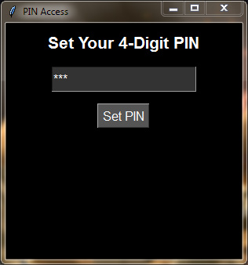
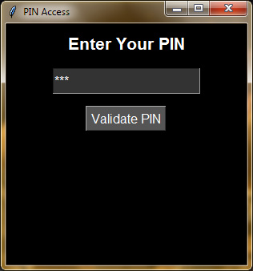
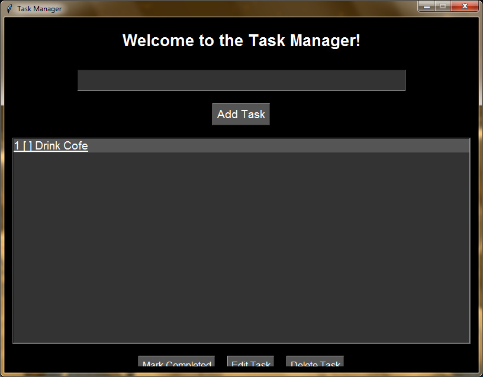

# Welcome in Task Manager - By **Aymene Boudali**

## Setup:

1. Run the **setup.exe** to start setup handler.

2. Complete the setup, and run the desktop shortcut **Task Manager**.

---------------------------
## The app:

* when the app start u have to enter a **4** digits **PIN**. Ex: **4865**.

* Then you have to re-enter your pin.

* when the app open you can enter your **task name** at the begining and press **Add Task** to add new task.

 # **The Edit Buttons:**

1. **Mark Completed:** to mark the selected task as completed.

2. **Edit Task:** to edit the selected task from the **Name input**

3. **Delete Task:** to delete the selected task *an confermation will open!*

> **Note:** The app will create a local database to store the data's!
